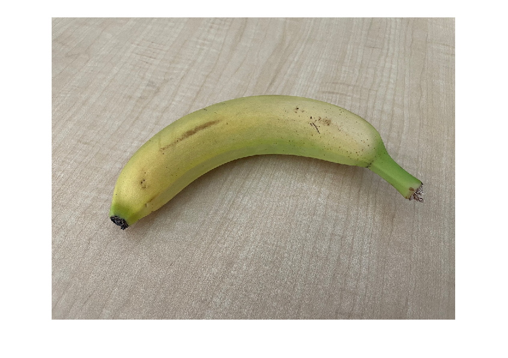
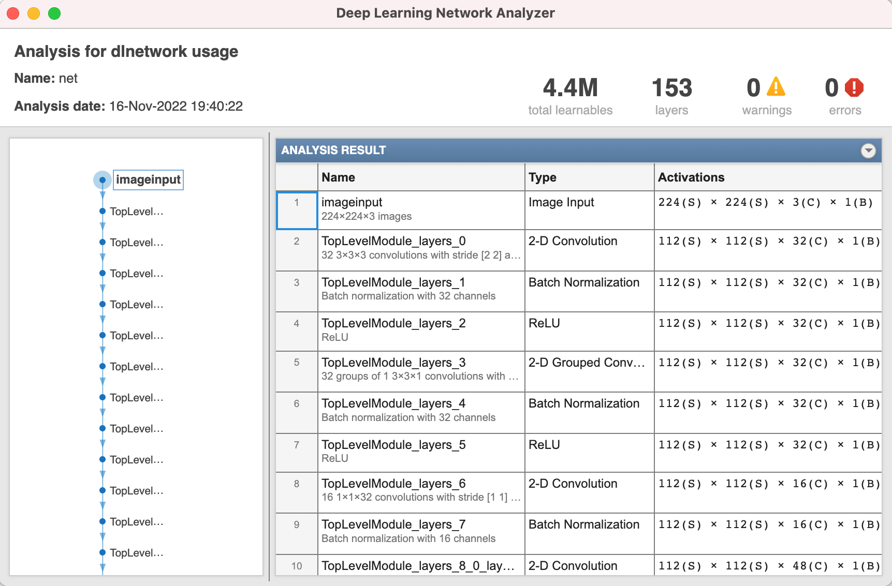
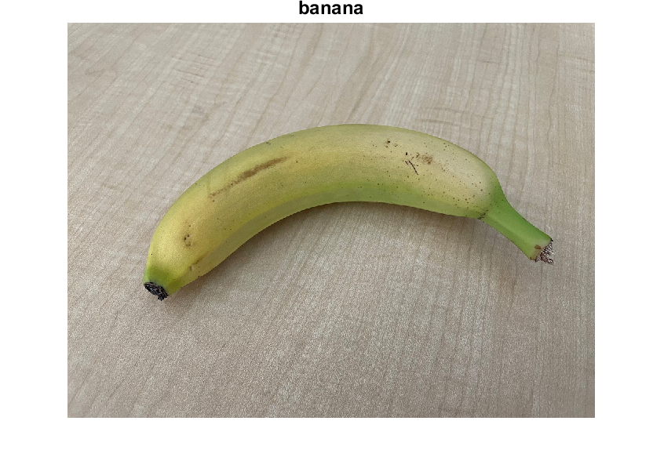

# Call Python from MATLAB to Compare PyTorch Models for Image Classification
# Overview


This example shows how to call Python® from MATLAB® to compare PyTorch® image classification models, and then import the fastest PyTorch model into MATLAB.


Preprocess an image in MATLAB, find the fastest PyTorch model with co-execution, and then import the model into MATLAB for deep learning workflows that Deep Learning Toolbox™ supports. For example, take advantage of MATLAB's easy-to-use low-code apps for visualizing, analyzing, and modifying deep neural networks, or deploy the imported network.


This example shows the co-execution workflow between PyTorch and Deep Learning Toolbox. You can use the same workflow for co-execution with TensorFlow™.


## Requirements
To run the following code, you need:
- [MATLAB](https://www.mathworks.com/products/matlab.html) R2022b
- [Deep Learning Toolbox](https://www.mathworks.com/products/deep-learning.html)
- [Python](https://www.python.org/) (tested with 3.10.8)
- [PyTorch](https://pytorch.org/) (tested with 1.13.0)
- [Torchvision](https://pytorch.org/vision/stable/index.html) (tested with 1.13.0)
- [NumPy](https://numpy.org/) (tested with 1.23.4)

# Python Environment


Set up the Python environment by first running commands at a command prompt (Windows® machine) and then, set up the Python interpreter in MATLAB.


Go to your working folder. Create the Python virtual environment `venv` in a command prompt outside MATLAB. If you have multiple versions of Python installed, you can specify which Python version to use for your virtual environment.


```matlab:Code(Display)
python -m venv env
```


Activate the Python virtual environment `env` in your working folder.


```matlab:Code(Display)
env\Scripts\activate
```


Install the necessary Python libraries for this example. Check the installed versions of the libraries.


```matlab:Code(Display)
pip install numpy torch torchvision
python -m pip show numpy torch torchvision
```


From MATLAB, set up the Python interpreter for MATLAB.


```matlab:Code
pe = pyenv(ExecutionMode="OutOfProcess",Version="env\Scripts\python.exe");
```

# PyTorch Models


Get three pretrained PyTorch models (VGG, MobileNet v2, and MNASNet) from the torchvision library. For more information, see [TORCHVISION.MODELS](https://pytorch.org/vision/0.8/models.html).


You can access Python libraries directly from MATLAB by adding the `py.` prefix to the Python name. For more information on how to access Python libraries, see [Access Python Modules from MATLAB - Getting Started](https://www.mathworks.com/help/matlab/matlab_external/create-object-from-python-class.html).


```matlab:Code
model1 = py.torchvision.models.vgg16(pretrained=true);
```


```matlab:Code
model2 = py.torchvision.models.mobilenet_v2(pretrained=true);
```


```matlab:Code
model3 = py.torchvision.models.mnasnet1_0(pretrained=true);
```


# Preprocess Image


Read the image you want to classify. Show the image.


```matlab:Code
imgOriginal = imread("banana.png");
imshow(imgOriginal)
```





Resize the image to the input size of the network.


```matlab:Code
InputSize = [224 224 3];
img = imresize(imgOriginal,InputSize(1:2));
```


You must preprocess the image in the same way as the training data. For more information, see [Input Data Preprocessing](https://www.mathworks.com/help/deeplearning/ug/tips-on-importing-models-from-tensorflow-pytorch-and-onnx.html#mw_7d593336-5595-49a0-9bc0-184ba6cebb80). Rescale the image. Then, normalize the image by subtracting the training images mean and dividing by the training images standard deviation. 


```matlab:Code
imgProcessed = rescale(img,0,1);

meanIm = [0.485 0.456 0.406];
stdIm = [0.229 0.224 0.225];
imgProcessed = (imgProcessed - reshape(meanIm,[1 1 3]))./reshape(stdIm,[1 1 3]);
```


Permute the image data from the Deep Learning Toolbox dimension ordering (HWCN) to the PyTorch dimension ordering (NCHW). For more information on input dimension data ordering for different deep learning platforms, see [Input Dimension Ordering](https://www.mathworks.com/help/deeplearning/ug/tips-on-importing-models-from-tensorflow-pytorch-and-onnx.html#mw_ca5d4cba-9c12-4f01-8fe1-6329730c92b2).


```matlab:Code
imgForTorch = permute(imgProcessed,[4 3 1 2]);
```

# Classify Image with Co-Execution


Check that the PyTorch models work as expected by classifying an image. Call Python from MATLAB to predict the label.


Get the class names from `squeezenet`, which is also trained with ImageNet images (same as the torchvision models).


```matlab:Code
squeezeNet = squeezenet;
ClassNames = squeezeNet.Layers(end).Classes;
```


Convert the image to a tensor in order to classify the image with a PyTorch model.


```matlab:Code
X = py.numpy.asarray(imgForTorch);
X_torch = py.torch.from_numpy(X).float();
```


Classify the image with co-execution using the MNASNet model. The model predicts the correct label.


```matlab:Code
y_val = model1(X_torch);

predicted = py.torch.argmax(y_val);
label = ClassNames(double(predicted.tolist)+1)
```


```text:Output
label = 
     banana 

```

# Compare PyTorch Models


Find the fastest PyTorch model by calling Python from MATLAB. Predict the image classification label multiple times for each of the PyTorch models.


```matlab:Code
N = 30;

for i = 1:N
    tic
    model1(X_torch);
    T(i) = toc;
end
mean(T)
```


```text:Output
ans = 0.5947
```


```matlab:Code
for i = 1:N
    tic
    model2(X_torch);
    T(i) = toc;
end
mean(T)
```


```text:Output
ans = 0.1400
```


```matlab:Code
for i = 1:N
    tic
    model3(X_torch);
    T(i) = toc;
end
mean(T)
```


```text:Output
ans = 0.1096
```


This simple test shows that the fastest model in predicting is MNASNet. You can run different tests on PyTorch models easily and fast with co-execution to find the model that best suits your application and workflow.


# Save PyTorch Model


You can execute Python statements in the Python interpreter directly from MATLAB by using the [`pyrun`](https://www.mathworks.com/help/matlab/ref/pyrun.html) function. The pyrun function is a stateful interface between MATLAB and Python that saves the state between the two platforms.


Save the fastest PyTorch model, among the three models compared. Then, trace the model. For more information on how to trace a PyTorch model, see [Torch documentation: Tracing a function](https://pytorch.org/docs/stable/generated/torch.jit.trace.html).


```matlab:Code
pyrun("import torch;X_rnd = torch.rand(1,3,224,224)")
pyrun("traced_model = torch.jit.trace(model3.forward,X_rnd)",model3=model3)
```


```matlab:Code
pyrun("traced_model.save('traced_mnasnet1_0.pt')")
```

# Import PyTorch Model


Import the MNASNet model by using the [`importNetworkFromPyTorch`](https://www.mathworks.com/help/deeplearning/ref/importnetworkfrompytorch.html) function. The function imports the model as an uninitialized `dlnetwork` object.


```matlab:Code
net = importNetworkFromPyTorch("traced_mnasnet1_0.pt")
```


```text:Output
Warning: Network was imported as an uninitialized dlnetwork. Before using the network, add input layer(s):

inputLayer1 = imageInputLayer(, Normalization="none");
net = addInputLayer(net, inputLayer1, Initialize=true);
net = 
  dlnetwork with properties:

         Layers: [152x1 nnet.cnn.layer.Layer]
    Connections: [163x2 table]
     Learnables: [210x3 table]
          State: [104x3 table]
     InputNames: {'TopLevelModule_layers_0'}
    OutputNames: {'aten__linear12'}
    Initialized: 0

  View summary with summary.

```


Create an image input layer. Then, add the image input layer to the imported network and initialize the network by using the [`addInputLayer`](https://www.mathworks.com/help/deeplearning/ref/dlnetwork.addinputlayer.html) function.


```matlab:Code
inputLayer = imageInputLayer(InputSize,Normalization="none");
net = addInputLayer(net,inputLayer,Initialize=true);
```


Analyze the imported network. Observe that there are no warnings or errors, which means that the network is ready to use.


```matlab:Code
analyzeNetwork(net)
```




# Classify Image in MATLAB


Convert the image to a [`dlarray`](https://www.mathworks.com/help/deeplearning/ref/dlarray.html) object. Format the image with dimensions "SSCB" (spatial, spatial, channel, batch).


```matlab:Code
Img_dlarray = dlarray(single(imgProcessed),"SSCB");
```


Classify the image and find the predicted label.


```matlab:Code
prob = predict(net,Img_dlarray);
[~,label_ind] = max(prob);
```


Show the image with the classification label.


```matlab:Code
imshow(imgOriginal)
title(ClassNames(label_ind),FontSize=18)
```





Copyright 2022, The MathWorks, Inc.


